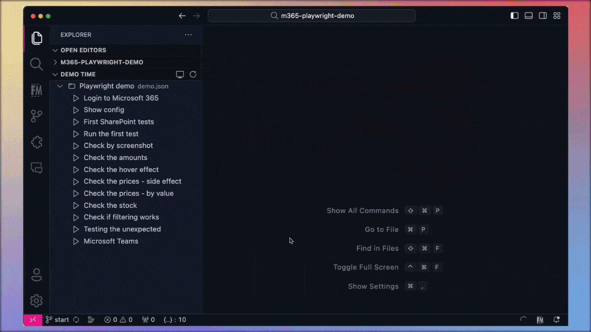
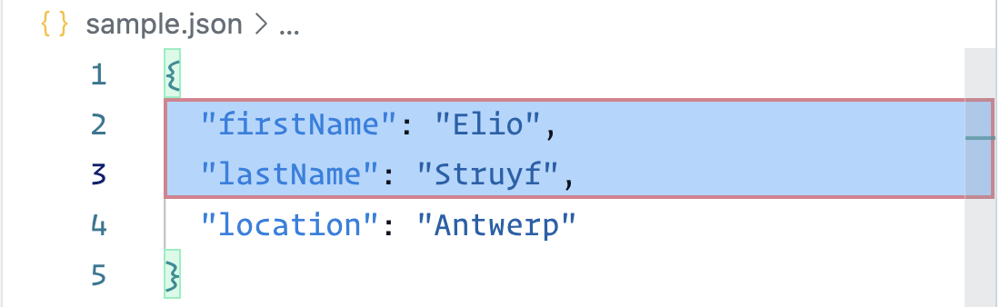
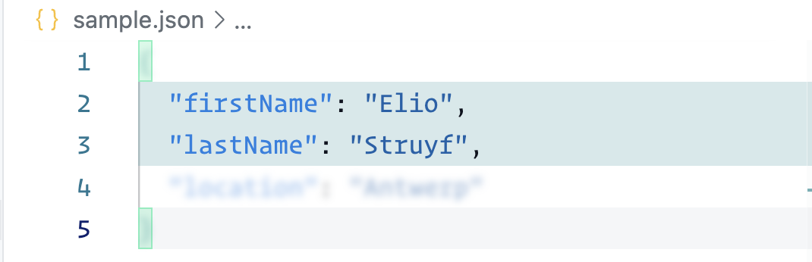
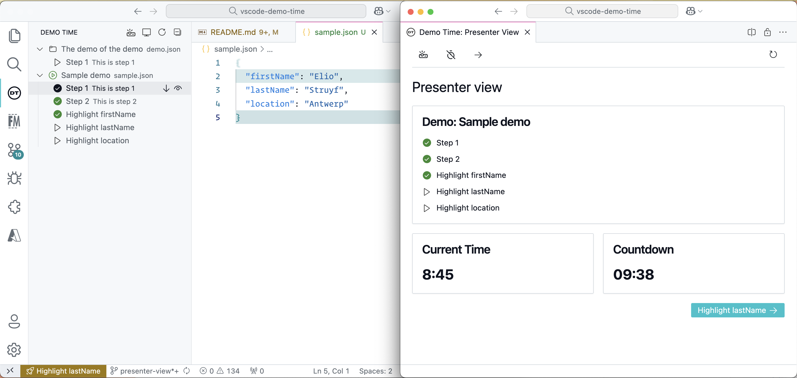

<h1 align="center">
  
</h1>

<h2 align="center">Script your coding demos to perfection and present slides — all within VS Code! No typos, no missteps—just flawless, stress-free presentations. Seamlessly execute each demo step and advance through slides like a pro, keeping your audience engaged without ever leaving your coding environment.</h2>

<p align="center">
  <a href="https://marketplace.visualstudio.com/items?itemName=eliostruyf.vscode-demo-time" title="Check it out on the Visual Studio Marketplace">
    
  </a>

  

  <a href="https://github.com/sponsors/estruyf" title="Become a sponsor" style="margin-left:10px">
    
  </a>
</p>

<h2 align="center">
  <a href="https://demotime.elio.dev/" title="Demo Time Documentation">
    Check out the extension documentation at demotime.elio.dev
  </a>
</h2>

<p align="center">
  
</p>

## Features

Currently, the extension supports the following features:

- Highlighting code in a file.
- Multiple demo files located in the `.demo` folder.
- Support for code/snippet files in the `.demo` folder, allowing you to define multiple reusable steps.
- Explorer panel to execute your demo steps (you can move it to the activity bar).
- Run through the demo steps by executing the `Demo Time: Start` command.
- Presentation mode that allows you to use a **clicker** to navigate through the demo steps.
- Run a specific demo step from a command execution using the `demo-time.runById` command.
- Place your variables in a `variables.json` file in the `.demo` folder and reference them like `{variable_name}` in your demo steps.
- Detachable presenter view which you can move to a different screen.
- Adding notes to your demo steps.

## Usage

To use the extension, you need to create a `.demo` folder in your workspace. Once created, you can add a JSON file which contains the demo and its steps.

```json
{
  "$schema": "https://demotime.elio.dev/demo-time.schema.json",
  "title": "<title>",
  "description": "<description>",
  "demos": []
}
```

Add your demos to the `demos` array. Each demo can consist of multiple steps.

```json
{
  "title": "<title>",
  "description": "<description>",
  "steps": []
}
```

You can also add "icons" to your demo steps to make them more recognizable. You can use the following icons:

```json
{
  "title": "<title>",
  "description": "<description>",
  "icons": {
    "start": "<name of the icon (optional)>",
    "end": "<name of the icon (optional)>"
  },
  "steps": []
}
```

> Use the icon names you can find in the [icon listing](https://code.visualstudio.com/api/references/icons-in-labels#icon-listing) from the Visual Studio Code documentation.

## Demo steps

### File actions

> Find more information on the [file actions](https://demotime.elio.dev/actions/file/) documentation page.

<table>
  <tr>
    <th>Action</th>
    <th>Description</th>
    <th>Usage</th>
  </tr>
  <tr>
    <td>
      <code>create</code>
    </td>
    <td>
      Create a new file
    </td>
    <td>

```json
{
  "action": "create",
  "path": "<relative path to the file>",
  "content": "<content of the file> (optional)",
  "contentPath": "<relative path to the file in the .demo folder> (optional)"
}
```

  </td>
  </tr>
  <tr>
    <td>
      <code>open</code>
    </td>
    <td>
      Open a file
    </td>
    <td>

```json
{
  "action": "open",
  "path": "<relative path to the file>"
}
```

  </td>
  </tr>
  <tr>
    <td>
      <code>markdownPreview</code>
    </td>
    <td>
      Preview a Markdown file
    </td>
    <td>

```json
{
  "action": "markdownPreview",
  "path": "<relative path to the file>"
}
```

  </td>
  </tr>
  <tr>
    <td>
      <code>save</code>
    </td>
    <td>
      Save the current active file
    </td>
    <td>

```json
{
  "action": "save"
}
```

  </td>
  </tr>
  <tr>
    <td>
      <code>rename</code>
    </td>
    <td>
      Rename a file
    </td>
    <td>

```json
{
  "action": "rename",
  "path": "<relative path to the file>",
  "dest": "<new file name/path>"
}
```

  </td>
  </tr>
  <tr>
    <td>
      <code>deleteFile</code>
    </td>
    <td>
      Delete a file
    </td>
    <td>

```json
{
  "action": "deleteFile",
  "path": "<relative path to the file>"
}
```

  </td>
  </tr>
  <tr>
    <td>
      <code>close</code>
    </td>
    <td>
      Close the current active file
    </td>
    <td>

```json
{
  "action": "close"
}
```

  </td>
  </tr>
  <tr>
    <td>
      <code>closeAll</code>
    </td>
    <td>
      Close all open files
    </td>
    <td>

```json
{
  "action": "closeAll"
}
```

  </td>
  </tr>
</table>

### Text actions

> Find more information on the [text actions](https://demotime.elio.dev/actions/text/) documentation page.

<table>
  <tr>
    <th>Action</th>
    <th>Description</th>
    <th>Usage</th>
  </tr>
  <tr>
    <td>
      <code>insert</code>
    </td>
    <td>
      Insert code into a file
    </td>
    <td>

```json
// Via position
{
  "action": "insert",
  "path": "<relative path to the file>",
  "position": "<position>",
  "content": "<content of the file> (optional)",
  "contentPath": "<relative path to the file in the .demo folder> (optional)",
  "lineInsertionDelay": "<delay in milliseconds to insert each line> (optional)"
}

// Via placeholders
{
  "action": "insert",
  "path": "<relative path to the file>",
  "startPlaceholder": "<start placeholder>",
  "endPlaceholder": "<end placeholder>",
  "content": "<content of the file> (optional)",
  "contentPath": "<relative path to the file in the .demo folder> (optional)",
  "lineInsertionDelay": "<delay in milliseconds to insert each line> (optional)"
}
```

  </td>
  </tr>
  <tr>
    <td>
      <code>replace</code>
    </td>
    <td>
      Replace code in a file
    </td>
    <td>

```json
// Via position
{
  "action": "replace",
  "path": "<relative path to the file>",
  "position": "<position>",
  "content": "<content of the file> (optional)",
  "contentPath": "<relative path to the file in the .demo folder> (optional)",
  "lineInsertionDelay": "<delay in milliseconds to insert each line> (optional)"
}

// Via placeholders
{
  "action": "replace",
  "path": "<relative path to the file>",
  "startPlaceholder": "<start placeholder>",
  "endPlaceholder": "<end placeholder>",
  "content": "<content of the file> (optional)",
  "contentPath": "<relative path to the file in the .demo folder> (optional)",
  "lineInsertionDelay": "<delay in milliseconds to insert each line> (optional)"
}
```

  </td>
  </tr>
  <tr>
    <td>
      <code>delete</code>
    </td>
    <td>
      Delete code from a file
    </td>
    <td>

```json
// Via position
{
  "action": "delete",
  "path": "<relative path to the file>",
  "position": "<position>"
}

// Via placeholders
{
  "action": "delete",
  "path": "<relative path to the file>",
  "startPlaceholder": "<start placeholder>",
  "endPlaceholder": "<end placeholder>"
}
```

  </td>
  </tr>
  <tr>
    <td>
      <code>highlight</code>
    </td>
    <td>
      Highlight code in a file. Check out the <a href="#settings" title="settings">settings</a> section to customize the highlight colors.
    </td>
    <td>

```json
// Via position
{
  "action": "highlight",
  "path": "<relative path to the file>",
  "position": "<position>",
  "zoom": "<zoom level> (optional)"
}

// Via placeholders
{
  "action": "highlight",
  "path": "<relative path to the file>",
  "startPlaceholder": "<start placeholder>",
  "endPlaceholder": "<end placeholder>",
  "zoom": "<zoom level> (optional)"
}
```

  </td>
  </tr>
  <tr>
    <td>
      <code>positionCursor</code>
    </td>
    <td>
      Postion the cursor at a specific line and character position
    </td>
    <td>

```json
// Via position
{
  "action": "positionCursor",
  "path": "<relative path to the file>",
  "position": "<position>"
}

// Via start placeholder
{
  "action": "positionCursor",
  "path": "<relative path to the file>",
  "startPlaceholder": "<start placeholder>",
}
```

  </td>
  </tr>
  <tr>
    <td>
      <code>unselect</code>
    </td>
    <td>
      Unselect code in a file
    </td>
    <td>

```json
{
  "action": "unselect",
  "path": "<relative path to the file>"
}
```

  </td>
  </tr>
  <tr>
    <td>
      <code>write</code>
    </td>
    <td>
      Write a single line of text to the editor
    </td>
    <td>

```jsonc
// Write to current active position
{
  "action": "write",
  "content": "Hello World"
}

// Write to a specific position in a file
// Via position
{
  "action": "write",
  "content": "Hello World",
  "path": "<relative path to the file>",
  "position": "<position>"
}

// Via start placeholder
{
  "action": "write",
  "content": "Hello World",
  "path": "<relative path to the file>",
  "startPlaceholder": "<start placeholder>",
}
```

  </td>
  </tr>
  <tr>
    <td>
      <code>format</code>
    </td>
    <td>
      Format the content of the active file
    </td>
    <td>

```jsonc
{
  "action": "format"
}
```

  </td>
  </tr>
</table>

### Patch actions

> Find more information on the [patch actions](https://demotime.elio.dev/actions/patch/) documentation page.

Similar to the Text actions, the patch actions can be used to update the contents of a file, but you do not need to specify the position of the text to insert. Instead, you need to create a snapshot of the file and a patch file.

A patch works like a git’s diff functionality, but instead of requiring a git branch, the base file is stored as a snapshot in the `.demo/snapshots` folder, and the patch file is stored in the `.demo/patches` folder.

<table>
  <tr>
    <th>Action</th>
    <th>Description</th>
    <th>Usage</th>
  </tr>
  <tr>
    <td>
      <code>applyPatch</code>
    </td>
    <td>
      Apply a patch to a file
    </td>
    <td>

```json
{
  "action": "applyPatch",
  "path": "<relative path to the file>", // This will be the source file to update
  "contentPath": "<relative path to the snapshot file in the .demo folder>",
  "patch": "<relative path to the patch file in the .demo folder>"
}
```

  </td>
  </tr>
</table>

### Setting actions

> Find more information on the [setting actions](https://demotime.elio.dev/actions/setting/) documentation page.

<table>
  <tr>
    <th>Action</th>
    <th>Description</th>
    <th>Usage</th>
  </tr>
  <tr>
    <td>
      <code>setSetting</code>
    </td>
    <td>
      Update a setting in Visual Studio Code
    </td>
    <td>

```json
{
  "action": "setSetting",
  "setting": {
    "key": "<setting key>",
    "value": "<value>"
  }
}
```

  </td>
  </tr>
  <tr>
    <td>
      <code>setTheme</code>
    </td>
    <td>
      Update the current theme
    </td>
    <td>

```json
{
  "action": "setTheme",
  "theme": "<theme name>"
}
```

  </td>
  </tr>
  <tr>
    <td>
      <code>unsetTheme</code>
    </td>
    <td>
      Reset the current theme
    </td>
    <td>

```json
{
  "action": "unsetTheme"
}
```

  </td>
  </tr>
</table>

#### Setting update example

Here is an example of how you can hide the activity and status bar in Visual Studio Code.

```json
{
  "action": "setSetting",
  "args": {
    "setting": "workbench.statusBar.visible",
    "value": false
  }
},
{
  "action": "setSetting",
  "args": {
    "setting": "workbench.activityBar.location",
    "value": "hidden"
  }
}
```

To reset the settings, you can use the following steps:

```json
{
  "action": "setSetting",
  "setting": {
    "key": "workbench.statusBar.visible",
    "value": null
  }
},
{
  "action": "setSetting",
  "setting": {
    "key": "workbench.activityBar.location",
    "value": null
  }
}
```

### Time actions

> Find more information on the [time actions](https://demotime.elio.dev/actions/time/) documentation page.

<table>
  <tr>
    <th>Action</th>
    <th>Description</th>
    <th>Usage</th>
  </tr>
  <tr>
    <td>
      <code>waitForTimeout</code>
    </td>
    <td>
      Wait for a specific amount of time
    </td>
    <td>

```json
{
  "action": "waitForTimeout",
  "timeout": "<timeout in milliseconds>"
}
```

  </td>
  </tr>
  <tr>
    <td>
      <code>waitForInput</code>
    </td>
    <td>
      Wait until the user presses a key
    </td>
    <td>

```json
{
  "action": "waitForInput"
}
```

  </td>
  </tr>
</table>

### VS Code actions

> Find more information on the [vscode actions](https://demotime.elio.dev/actions/vscode/) documentation page.

<table>
  <tr>
    <th>Action</th>
    <th>Description</th>
    <th>Usage</th>
  </tr>
  <tr>
    <td>
      <code>executeVSCodeCommand</code>
    </td>
    <td>
      Execute a VSCode command
    </td>
    <td>

```json
{
  "action": "executeVSCodeCommand",
  "command": "<command to execute>",
  "args": "<arguments to pass to the command (optional)>",
  "path": "<relative path to the file (optional, when defined, the args property is ignored.)>"
}
```

  </td>
  </tr>
  <tr>
    <td>
      <code>showInfoMessage</code>
    </td>
    <td>
      Show a notification in Visual Studio Code
    </td>
    <td>

```json
{
  "action": "showInfoMessage",
  "message": "<message>"
}
```

  </td>
  </tr>
  <tr>
    <td>
      <code>setState</code>
    </td>
    <td>
      Set a state in the extension which is cleared on startup or when you reset the demos. You can use the state value in your demo steps by using the following <code>{STATE_&lt;key&gt;}</code> syntax.
    </td>
    <td>

```json
{
  "action": "setState",
  "state": {
    "key": "<key>",
    "value": "<value>"
  }
}
```

  </td>
  </tr>
</table>

### Terminal actions

> Find more information on the [terminal actions](https://demotime.elio.dev/actions/terminal/) documentation page.

<table>
  <tr>
    <th>Action</th>
    <th>Description</th>
    <th>Usage</th>
  </tr>
  <tr>
    <td>
      <code>executeTerminalCommand</code>
    </td>
    <td>
      Execute a command in the terminal
    </td>
    <td>

```json
{
  "action": "executeTerminalCommand",
  "command": "<command to execute>",
  "terminalId": "<terminal id (optional)>"
}
```

  </td>
  </tr>
  <tr>
    <td>
      <code>executeScript</code>
    </td>
    <td>
      Execute a script in the background of which you can use the output in the next steps with <code>{SCRIPT_&lt;script id&gt;}</code> syntax.
    </td>
    <td>

```json
{
  "action": "executeScript",
  "id": "<script id>",
  "path": "<script to execute>",
  "command": "node" // Can be powershell, bash, shell, python, etc.
}
```

  </td>
  </tr>
  <tr>
    <td>
      <code>closeTerminal</code>
    </td>
    <td>
      Close the terminal
    </td>
    <td>

```json
{
  "action": "closeTerminal",
  "command": "<command to execute>",
  "terminalId": "<terminal id (optional)>"
}
```

  </td>
  </tr>
</table>

### Snippets

> Find more information on the [snippet actions](https://demotime.elio.dev/actions/snippet/) documentation page.

<table>
  <tr>
    <th>Action</th>
    <th>Description</th>
    <th>Usage</th>
  </tr>
  <tr>
    <td>
      <code>snippet</code>
    </td>
    <td>
      Use a snippet in which you can define multiple reusable steps
    </td>
    <td>

```jsonc
{
  "action": "snippet",
  "contentPath": "<relative path to the file in the .demo folder> (optional)"
  "args": {
    // Define the argument name in the snippet file with curly braces {argument name}
    "<argument name>": "<argument value>"
  }
}
```

  </td>
  </tr>
</table>

> You can find examples of snippets in the [snippets](https://github.com/estruyf/vscode-demo-time/tree/dev/snippets) folder.

#### Snippet example

In the demo file, you can reference a snippet file. The snippet file can contain multiple steps which can be reused in multiple demos.

```json
{
  "action": "snippet",
  "contentPath": "./snippets/insert_and_highlight.json",
  "args": {
    "MAIN_FILE": "sample.json",
    "CONTENT_PATH": "content.txt",
    "CONTENT_POSITION": "3",
    "HIGHLIGHT_POSITION": "4"
  }
}
```

> The `contentPath` property its value is relative to the `.demo` folder. So, in the example above, the snippet file is located in the `.demo/snippets` folder.

> In the `args` property, you can define the arguments/variables which you want to use in the snippet file. In the snippet file, you can reference these arguments with curly braces `{argument name}`.

In the `insert_and_highlight.json` file, you can define the steps you want to execute.

```json
[
  {
    "action": "unselect",
    "path": "{MAIN_FILE}"
  },
  {
    "action": "insert",
    "path": "{MAIN_FILE}",
    "contentPath": "{CONTENT_PATH}",
    "position": "{CONTENT_POSITION}"
  },
  {
    "action": "highlight",
    "path": "{MAIN_FILE}",
    "position": "{HIGHLIGHT_POSITION}"
  }
]
```

## Settings

| Setting                         | Description                                                                                                                    | Default                                    |
| ------------------------------- | ------------------------------------------------------------------------------------------------------------------------------ | ------------------------------------------ |
| `demoTime.highlightBackground`  | The background color of the highlighted code.                                                                                  | `var(--vscode-editor-selectionBackground)` |
| `demoTime.highlightBorderColor` | The border color of the highlighted code.                                                                                      | `rgba(255,0,0,0.5)`                        |
| `demoTime.highlightBlur`        | Blur effect on the text which is not highlighted.                                                                              | `0`                                        |
| `demoTime.highlightOpacity`     | The opacity of the text which is not highlighted. Number between 0 and 1.                                                      | `0.5`                                      |
| `demoTime.highlightZoomEnabled` | Enable zooming when highlighting code.                                                                                         | `false` \| `number (zoom level)`           |
| `demoTime.previousEnabled`      | Enable the previous command when in presentation mode.                                                                         | `false`                                    |
| `demoTime.showClock`            | Show a clock in the status bar.                                                                                                | `true`                                     |
| `demoTime.timer`                | Count down timer for how long the session should last. If not set, it will not count down. The value is the number of minutes. | `null`                                     |
| `demoTime.lineInsertionDelay`   | The speed in milliseconds for inserting lines. If you set it to `0`, it will insert its content immediately.                   | `25`                                       |
| `demoTime.api.enabled`          | Enable the API to control the extension.                                                                                       | `false`                                    |
| `demoTime.api.port`             | The port on which the API should run.                                                                                          | `3710`                                     |

> The `demoTime.previousEnabled` is by default disabled to avoid conflicts when the previous action inserted content into a file.
> When you enable this setting, you can use the `Demo Time: Previous` command to go back to the previous step or use the left clicker button.

## Commands

| Command                               | Description                                                                                                                                                |
| ------------------------------------- | ---------------------------------------------------------------------------------------------------------------------------------------------------------- |
| `Demo Time: Start`                    | Starts the demo or runs the next demo step.                                                                                                                |
| `Demo Time: Previous`                 | Go back to the previous demo step (only in presentation mode and when the `demoTime.previousEnabled` setting is enabled).                                  |
| `Demo Time: Add as demo step`         | Add the current selection as a demo step to the demo file.                                                                                                 |
| `Demo Time: Reset`                    | Reset all the demos.                                                                                                                                       |
| `Demo Time: Start countdown`          | Start the countdown clock (you need to define the time in the `demoTime.timer` setting).                                                                   |
| `Demo Time: Reset countdown`          | Reset the countdown clock.                                                                                                                                 |
| `Demo Time: Toggle presentation mode` | Toggle the presentation mode. In this mode you'll be able to use your clicker or arrow keys for the `Demo Time: Start` and `Demo Time: Previous` commands. |
| `Demo Time: Show presenter view`      | Open the presenter view which you can detach and move to another screen while presenting.                                                                  |

> The `Demo Time: Start` and `Demo Time: Previous` commands have a keybinding assigned to them.
> You can override these keybindings in your Visual Studio Code settings.

## API

The extension provides an API which you can use to control the extension. You can enable the API by setting the `demoTime.api.enabled` setting to `true`. When enabled, the API will run on the port defined in the `demoTime.api.port` setting.

API URL: `http://localhost:3710/api/next`

### API endpoints

#### `/api/next`

This endpoint will execute the next step in the demo.

- Method: `GET`
- Query parameters:
  - `bringToFront`: Bring the Visual Studio Code window to the front. Default is `false`.

#### `/api/runById`

This endpoint will execute a specific step by its ID in your demo.

You can call this endpoint via a `GET` or `POST` request.

##### GET request

- Method: `GET`
- Query parameters:
  - `id`: The ID of the step you want to
  - `bringToFront`: Bring the Visual Studio Code window to the front. Default is `false`.

##### POST request

- Method: `POST`
- Body:

  ```json
  {
    "id": "<step id>",
    "bringToFront": "<bring the Visual Studio Code window to the front (optional) - default is false>"
  }
  ```

- Headers:
  - `Content-Type: application/json`

## Tips and tricks

### Adding notes

You are also able to add notes to your demos. These notes can be used to provide additional information for yourself or others who will be executing the demo.

The notes should be created as a markdown file in the `.demo` folder. Here is an example of how you can add notes to your demo:

```json
{
  "title": "<title>",
  "description": "<description>",
  "steps": [...],
  "notes": {
    "path": "<relative path in the .demo folder>",
    "showOnTrigger": "<show notes on trigger (optional) - default is false>"
  }
}
```

### Highlighting code

By default, the extension highlights the code in a box with a red border. You can customize how you want to highlight the code with the highlight settings.



#### Customizing the highlight

Here is an example where the highlight border and background color are customized. Besides these color changes, the text which is not highlighted is blurred and its opacity is reduced to have a better focus on the highlighted code.

```json
{
  "demoTime.highlightBorderColor": "transparent",
  "demoTime.highlightBackground": "rgba(19, 142, 151, 0.2)",
  "demoTime.highlightOpacity": 0.5,
  "demoTime.highlightBlur": 2
}
```



### Working with variables

You can define variables in a `variables.json` file in the `.demo` folder. You can reference these variables in your demo steps by using curly braces `{variable_name}`.

The extension has also built-in support for a couple of predefined variables:

- `{DT_INPUT}`: The extension will ask you to provide a value for this variable when the demo gets executed.
- `{DT_CLIPBOARD}`: The value in your clipboard will be used for this variable.
- `{SCRIPT_<key>}`: The output of the script which you executed via the `executeScript` action, will be used for this variable.
- `{STATE_<key>}`: The value of the state key which you set via the `setState` action, will be used for this variable.

#### Example variables file

```json
{
  "SLIDES_URL": "http://localhost:3030"
}
```

#### Example demo step

```json
{
  "action": "executeVSCodeCommand",
  "command": "simpleBrowser.show",
  "args": "{SLIDES_URL}"
}
```

### Positioning your text/code

For the positioning of the text to insert, there are two options:

- Use the `position` property to specify the location where the action should be performed. With this property, you can specify the line number, character position, or a range of lines and characters.
- Use the `startPlaceholder` and `endPlaceholder` properties to specify the text to search for in the file to determine the location where the action should be performed.

#### Line position or range

For the `position` property, you can use the following values:

- `number`: The line number
- `number:number`: The start and end line number
- `number,number`: The start line and character
- `number,number:number,number`: The start line and character and the end line and character
- The `start` and `end` keywords can also be used instead of the line numbers
  - `start` will be replaced by the first line number
  - `end` will be replaced by the last line number

Examples:

```jsonc
"position": "10" // Line 10
"position": "10:20" // Lines 10 to 20
"position": "10,5" // Start line 10, character 5
"position": "10,5:20,10" // Start line 10, character 5 to end line 20, character 10
```

#### Placeholder position

For the `startPlaceholder` and `endPlaceholder` properties, you specify the text to search for in the file.

Examples:

```jsonc
"startPlaceholder": "// Start of demo1"
"endPlaceholder": "// End of demo1"
```

> The text will be replaced from the start of the `startPlaceholder` to the end of the `endPlaceholder`.

In the file, the placeholders should be defined like this:

```javascript
// Start of demo1
const ext = "Demo Time";
// End of demo1
```

### Adding content to a file

When you want to insert content to a file, you can use the `content` or `contentPath` properties in the demo step.

| Property      | Description                                                                                                                                                                                                      |
| ------------- | ---------------------------------------------------------------------------------------------------------------------------------------------------------------------------------------------------------------- |
| `content`     | This property allows you to add the content directly in the JSON file, but this can make your JSON file quite big and it can be hard to read.                                                                    |
| `contentPath` | This property allows you to reference a file in the `.demo` folder. This way you can keep your JSON file clean and add the content in separate files. **Important**: the path is relative to the `.demo` folder. |

### Presentation view

When you use two screens during a presentation, you can use the detachable presenter view which you can move to another screen. This way you can keep an eye on the next steps while presenting without showing it to your audience.

Follow these steps to use the presenter view:

- Run the `Demo Time: Show presenter view` command to open the presenter view.
- The presenter view will open in detached mode. If that is not the case, you can drag tab out of the Visual Studio Code window.
- Once detached, you can move it to another screen.



### Example demo file

Here is an example demo:

```json
{
  "$schema": "https://demotime.elio.dev/demo-time.schema.json",
  "title": "Sample demo",
  "description": "This is a sample demo configuration to show the capabilities of the extension.",
  "demos": [
    {
      "title": "Step 1",
      "description": "This is step 1",
      "steps": [
        {
          "action": "create",
          "path": "sample.json",
          "content": "{\n  \"firstName\": \"Elio\",\n  \"lastName\": \"Struyf\"\n}"
        },
        {
          "action": "open",
          "path": "sample.json"
        },
        {
          "action": "highlight",
          "path": "sample.json",
          "position": "2:3"
        }
      ]
    },
    {
      "title": "Step 2",
      "description": "This is step 2",
      "steps": [
        {
          "action": "snippet",
          "contentPath": "./snippets/insert_and_highlight.json",
          "args": {
            "MAIN_FILE": "sample.json",
            "CONTENT_PATH": "content.txt",
            "CONTENT_POSITION": "3",
            "HIGHLIGHT_POSITION": "4"
          }
        }
      ]
    }
  ]
}
```

You can also explore a comprehensive example in the following GitHub Repositories:

- [presentation-github-actions](https://github.com/estruyf/presentation-github-actions)
- [presentation-m365-playwright-github-actions](https://github.com/estruyf/presentation-m365-playwright-github-actions)

## Support

If you enjoy my work and find them useful, consider sponsor me and the ecosystem to help Open Source sustainable. Thank you!

<p align="center">
  <a href="https://github.com/sponsors/estruyf" title="Sponsor Elio Struyf" target="_blank">
    
  </a>
</p>

<br />

<p align="center">
  <a href="https://visitorbadge.io/status?path=https%3A%2F%2Fgithub.com%2Festruyf%2Fvscode-demo-time">
    
  </a>
</p>

<br />

<p align="center">
  <a href="https://struyfconsulting.com" title="Hire Elio Struyf via Struyf Consulting" target="_blank">
    
  </a>
</p>
