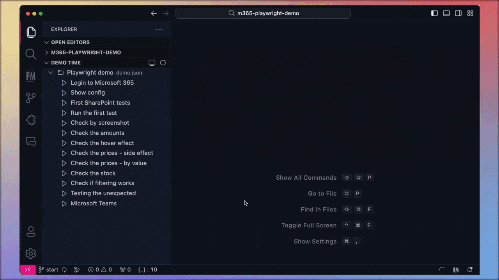

<h1 align="center">
  
</h1>

<h2 align="center">Demo Time empowers you to script flawless coding demonstrations and present slides seamlessly within Visual Studio Code. Eliminate typos and missteps, ensuring engaging and stress-free presentations..</h2>

<p align="center">
  <a href="https://marketplace.visualstudio.com/items?itemName=eliostruyf.vscode-demo-time" title="Check it out on the Visual Studio Marketplace">
    
  </a>

  

  <a href="https://github.com/sponsors/estruyf" title="Become a sponsor" style="margin-left:10px">
    
  </a>
</p>

<h2 align="center">
  <a href="https://demotime.elio.dev/" title="Demo Time Documentation">
    Documentation 👉 demotime.elio.dev
  </a>
</h2>

<p align="center">
  
</p>

## Features

- **Scripted Demos**: Automate your coding demonstrations to maintain a perfect flow.​
- **Code Highlighting**: Emphasize specific code segments to draw audience attention.​
- **Integrated Slides**: Present slides directly within VS Code for a cohesive experience.​
- **Customizable Actions**: Execute various VS Code commands and tasks as part of your demo.

## Headers and Footers

You can add global or slide-specific headers and footers to your presentation. These are defined in the frontmatter and are processed using Handlebars templating, offering great flexibility.

-   `header`: A Handlebars template string for the header.
-   `footer`: A Handlebars template string for the footer.

These properties can be defined at the top of your Markdown file (document-level) to apply to all slides, or within the frontmatter of a specific slide to override the global settings or apply only to that slide.

### Templating Data Context
When your header and footer templates are rendered, they have access to the following data:

*   `frontmatter`: An object containing all the frontmatter key-value pairs for the current slide. For example, if your slide's frontmatter has `author: "Jane Doe"`, you can use `{{frontmatter.author}}`.
*   `slide_number`: The current slide number (e.g., `{{slide_number}}`).
*   `total_slides`: The total number of slides (e.g., `{{total_slides}}`).
*   `date`: The current date, formatted according to system locale (e.g., `{{date}}`).

### Example

```markdown
---
title: "My Awesome Presentation"
author: "John Smith"
header: "{{frontmatter.title}} - {{date}}"
footer: "Slide {{slide_number}} of {{total_slides}} - © {{frontmatter.author}}"
---

# First Slide Title
This slide will use the global header and footer, rendering data from its own frontmatter.

---
author: "Alice Wonderland"
footer: "Special Footer by {{frontmatter.author}} ({{slide_number}}/{{total_slides}})"
---

# Second Slide Title
This slide has the global header but a custom footer, using its own author.
```

## Getting Started

1. **Installation**: Install the extension.​
2. **Initialization**: After installation, initialize the extension in your project by opening the Explorer panel in VS Code. Locate the **Demo Time** view and click on the "**Initialize**" button. This action creates a `.demo` folder in your workspace containing a `demo.json` file.​
3. **Creating Demos**: Populate the `demo.json` file with your actions, defining each step and action as required.​ More information about the available actions can be found in the [supported actions](https://demotime.elio.dev/actions/) documenation section.

## Documentation

For detailed instructions, advanced configurations, and best practices, please refer to the comprehensive documentation available at [https://demotime.elio.dev](https://demotime.elio.dev). This resource offers in-depth guides and examples to help you maximize the extension's capabilities.

## Example demo file

Here is an example demo:

```json
{
  "$schema": "https://demotime.elio.dev/demo-time.schema.json",
  "title": "Sample demo",
  "description": "This is a sample demo configuration to show the capabilities of the extension.",
  "demos": [
    {
      "title": "Step 1",
      "description": "This is step 1",
      "steps": [
        {
          "action": "create",
          "path": "sample.json",
          "content": "{\n  \"firstName\": \"Elio\",\n  \"lastName\": \"Struyf\"\n}"
        },
        {
          "action": "open",
          "path": "sample.json"
        },
        {
          "action": "highlight",
          "path": "sample.json",
          "position": "2:3"
        }
      ]
    },
    {
      "title": "Step 2",
      "description": "This is step 2",
      "steps": [
        {
          "action": "snippet",
          "contentPath": "./snippets/insert_and_highlight.json",
          "args": {
            "MAIN_FILE": "sample.json",
            "CONTENT_PATH": "content.txt",
            "CONTENT_POSITION": "3",
            "HIGHLIGHT_POSITION": "4"
          }
        }
      ]
    }
  ]
}
```

You can also explore a comprehensive example in the following GitHub Repositories:

- [Introduction presentation about Demo Time](https://github.com/estruyf/demo-time-presentation)
- [presentation-github-actions](https://github.com/estruyf/presentation-github-actions)
- [presentation-m365-playwright-github-actions](https://github.com/estruyf/presentation-m365-playwright-github-actions)

## Support

If you enjoy my work and find them useful, consider sponsor me and the ecosystem to help Open Source sustainable. Thank you!

<p align="center">
  <a href="https://github.com/sponsors/estruyf" title="Sponsor Elio Struyf" target="_blank">
    
  </a>
</p>

<br />

<p align="center">
  <a href="https://visitorbadge.io/status?path=https%3A%2F%2Fgithub.com%2Festruyf%2Fvscode-demo-time">
    
  </a>
</p>

<br />

<p align="center">
  <a href="https://struyfconsulting.com" title="Hire Elio Struyf via Struyf Consulting" target="_blank">
    
  </a>
</p>
