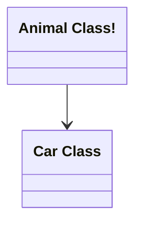
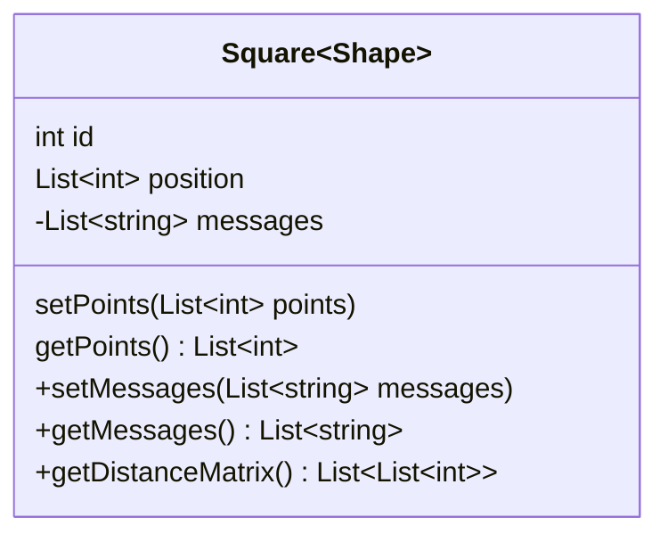

# Mermaid - Multiple diagrams

  

```mermaid
classDiagram
    class `Animal Class!`
    class `Car Class`
    `Animal Class!` --> `Car Class`
```

```mermaid
classDiagram
class Square~Shape~{
    int id
    List~int~ position
    setPoints(List~int~ points)
    getPoints() List~int~
}

Square : -List~string~ messages
Square : +setMessages(List~string~ messages)
Square : +getMessages() List~string~
Square : +getDistanceMatrix() List~List~int~~
```

