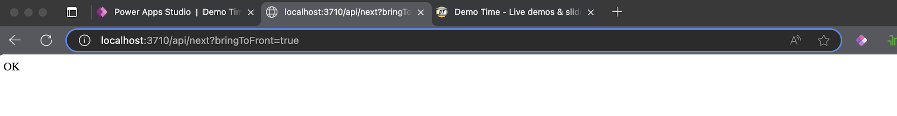

As a Power Platform consultant, I love keeping my presentations and demos as interactive as possible. That means not just slides, talks, and code examples, but also live demos—often directly in Power Platform.

In the past, this was always a bit of a hassle: switching from your PowerPoint or Keynote presentation to the browser, opening the right tab, running your demo, and then switching back to your presentation. Not only inconvenient for you, but also distracting for your audience!

This is where Demo Time in Visual Studio Code comes to the rescue!


## The Challenge

Opening other applications or hyperlinks (via a browser) is no problem at all with Demo Time—just check out the many possibilities outlined in the [documentation](https://demotime.show/getting-started/).

In most cases, I give presentations and demos related to the Power Platform, all of which are web applications I access through the browser. However, constantly reloading links takes up a lot of (waiting) time—loading environments, apps, MFA, and so on can be time-consuming. That’s why I prepare all the necessary tabs in my browser ahead of time.

But here’s the catch: I want to link directly to the right browser tab from my presentation—the one that’s already open—and this is where Demo Time’s unmatched flexibility really shines.

Since I work on macOS (sorry, Windows users), I started exploring ways to open active browser tabs via a command, so I could instantly switch to the right tab for my live demo during a presentation. I quickly found a great solution using AppleScript!


## The result


In the example above, I first open two slides, then I want to switch to my active Power Apps Studio, return to the next step in my demo (a slide), and finally open another active tab (the Demo Time website).

## The steps

First we need Visual Studio Code, the Demo Time extension, and a demo to get started. For a detailed guide on how to start, see documentation [here](https://demotime.show/getting-started/).

As preparation, I've already created a demo file named **demo**.

Next, I created a folder named **slides** and added three slides to it:

* intro.md
* first-slide.md
* second-slide.md


You can find more information about creating slides, themes, animations, and more [here](https://demotime.show/slides/).


### Adding Slides

Now we’re going to add the first two slides to the demo file.

Open the **demo.yaml** file

Click on **+ Add Demo**

Give the demo a **title** and optionally add a description

Click on **+ Add Step**

Choose the action **openSlide** and select the slide you want to add (Path)


### Adding AppleScript

Now we’re going to add a bit of AppleScript that will allow us to directly open a specific tab in the browser.

Create a new file named **open-browser-tab.scpt**

Paste the following code into this file

```
on run argv
    set tabIndex to item 1 of argv
    tell application "Microsoft Edge"
        tell window 1
            set active tab index to tabIndex as integer
        end tell
        activate
    end tell
end run
```

Later, we’ll be able to call this script and pass in a variable (an integer) representing the number of the tab we want to open.


Now go back to your demo file—in this case, **demo.yaml**.

Click **+ Add Demo**

Choose a name, in this example: Open Edge tab

Click **+ Add Step**

Choose the action **executeTerminalCommand**

Add the following code under Command:

```
osascript .demo/slides/open-browser-tab.scpt 1
```


### The Result So Far

In my Edge browser, I’ve now opened two tabs: the first one points to a Power App, and the second one to the Demo Time website.

Now, let’s switch to Demo Time in presentation mode and walk through the steps of your demo.


Now we’re going to add two more demos to the demo file.

Add a demo and a step to open the slide **second-slide.md**

Then, add another demo and step to open the second active tab in Edge, using the following command:

```
osascript .demo/slides/open-browser-tab.scpt 3
```

As you can see, we’re now passing the value 3 as a variable, which will open the third active tab in your Edge browser.


We’ve now created all the necessary steps in the demo file, which means we can also open specific browser tabs directly.


### There’s More ...

Demo Time also offers its own API, which allows you to navigate back to your Demo Time presentation from other applications. With this API, you can even trigger a specific step or simply move to the next step in your presentation.

In this case, I’m using the API from within my Power App to return to Demo Time and activate the next step. For this, I’m using the following URL:

```
http://localhost:3710/api/next?bringToFront=true
```

I add the URL to the Launch function in the OnSelect property of a button in my Power Apps Canvas app.


You can find more information about the Demo Time API [here](https://demotime.show/references/api/).


## Tips & tricks

### Terminal

In the steps above, executing an executeTerminalCommand will by default open a terminal window. To hide this window again, you can add a step in the same demo to close it.

Create a second step

Choose the action **executeVSCodeCommand**

Enter the following command

```
workbench.action.terminal.killAll
```

Like in the example below


### Browser tabs

In this demo, the Demo Time API is used via a hyperlink from Power Apps. Because the browser is triggered first, a new tab opens immediately to the right of the last active tab.

It’s important to aware of this when determining which tab to open next. In the example above, I had two tabs open beforehand, but this is what happens when opening the first tab.




## YAML file

Below is the complete YAML code you can use as a basis for your own demo file.

```
title: demo
description: 'Opening browser tabs using Apple Script'
version: 2
demos:
  - id: demo-mdlp53pu-fqqx
    title: Intro
    steps:
      - action: openSlide
        path: .demo/slides/intro.md
    description: Intro slide
  - id: demo-mdlp5smk-f2dn
    title: First slide
    steps:
      - action: openSlide
        path: .demo/slides/first-slide.md
    description: Open first slide
  - id: demo-mdlq3n9e-gjx2
    title: Open Edge tab
    steps:
      - action: executeTerminalCommand
        command: osascript .demo/slides/open-browser-tab.scpt 1
      - action: executeVSCodeCommand
        command: workbench.action.terminal.killAll
    description: Opening first tab
  - id: demo-mdlr5avk-km3a
    title: Second slide
    steps:
      - action: openSlide
        path: .demo/slides/second-slide.md
    description: Open second slide
  - id: demo-mdlr7yto-gaj7
    title: Open Edge tab (3)
    steps:
      - action: executeTerminalCommand
        command: osascript .demo/slides/open-browser-tab.scpt 3
      - action: executeVSCodeCommand
        command: workbench.action.terminal.killAll
    description: Opening second tab
```