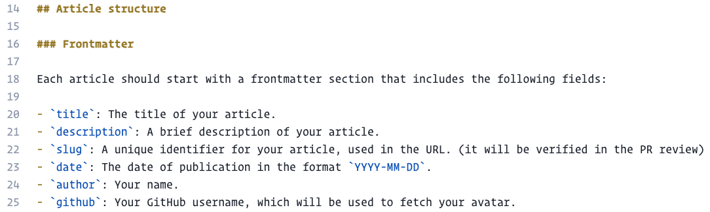

We invite you to share your knowledge and experiences with the community! To contribute your own article, simply add a Markdown file to the `src/content/articles` directory in this repository. Use this article as a template—just update the frontmatter with your name and GitHub username, and your avatar will appear automatically.

You can find the GitHub repository for this project at [https://github.com/estruyf/demo-time-docs](https://github.com/estruyf/demo-time-docs). Fork the repo, add your article, and submit a pull request to contribute!

Whether you want to share tips, tutorials, or stories, your contributions are welcome. Let's build a valuable resource together!

## Article structure

Each article is created in their own folder under `src/content/articles`, and the main content is written in a Markdown file named `index.md`. This structure helps keep things organized and makes it easy to add new articles.

### Frontmatter

Each article should start with a frontmatter section that includes the following fields:

- `title`: The title of your article.
- `description`: A brief description of your article.
- `slug`: A unique identifier for your article, used in the URL. (it will be verified in the PR review)
- `date`: The date of publication in the format `YYYY-MM-DD`.
- `author`: Your name.
- `github`: Your GitHub username, which will be used to fetch your avatar.

```markdown title="example frontmatter"
---
title: "Welcome to the Demo Time Articles!"
description: "This is an example article to show how community members can contribute."
slug: "welcome-to-demo-time-articles"
date: 2025-07-25
author: "Elio Struyf"
github: "estruyf"
---
```

### Content

After the frontmatter, you can write your article content in Markdown format. Use headings, lists, code blocks, and other Markdown features to structure your content effectively.

#### Images

Images can be added to the article folder and referenced in the Markdown content using the relative path. For example, if you have an image named `image.png` in the same folder as your article, you can include it like this:

```markdown title="example image reference"

```


Happy writing!
