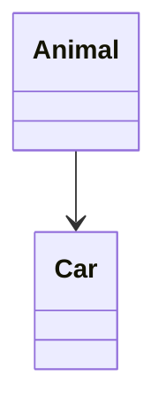
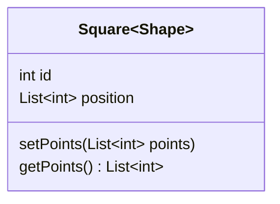

import { Aside, Code, Tabs, TabItem } from '@astrojs/starlight/components';
import { Image } from 'astro:assets';

import mermaidBasicImg from "../../../assets/docs/mermaid-basic.webp";
import mermaidMultipleImg from "../../../assets/docs/mermaid-multiple.webp";


Demo Time supports [Mermaid diagrams](https://mermaid.js.org/), allowing you to create flowcharts, sequence diagrams, and more directly in your slides.

<Aside type="tip">
Read the [Mermaid documentation](https://mermaid.js.org/) for more information on how to use it.
</Aside>

## Basic Usage

To create a Mermaid diagram, use the `mermaid` code block syntax:

````markdown title="Basic Mermaid Diagram"

````

<Image class="mx-auto" src={mermaidBasicImg} alt="Basic Mermaid Diagram" />

## Multiple Diagrams

You can display multiple diagrams side by side using flexbox:

````markdown
<div style="display: flex; gap: 1rem; flex-wrap: wrap;">
  




</div>
````

<Image class="mx-auto" src={mermaidMultipleImg} alt="Multiple Mermaid Diagrams loaded on a slide" />
